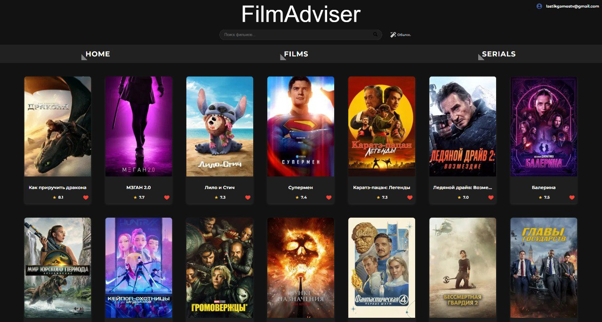
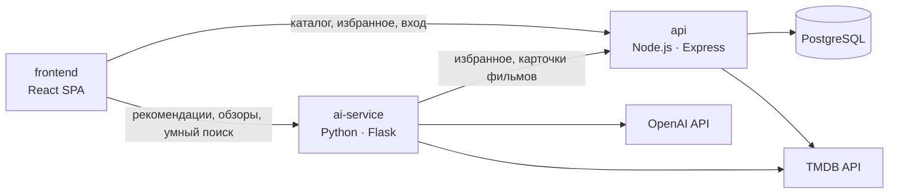

# FilmAdviser

Киносервис: каталог фильмов и сериалов из TMDB, избранное, лента рекомендаций по
вкусам пользователя, обзоры фильмов от языковой модели и поиск запросом на
естественном языке («триллеры 90-х с Джимом Керри»).

Pet-проект 2024–2025 годов. Изначально жил в трёх репозиториях — по одному на
сервис; здесь они собраны вместе с сохранением истории.

<p align="center"></p>

## Архитектура



| Сервис | Стек | Что делает |
|---|---|---|
| [`frontend/`](frontend) | React 18, TypeScript, React Router | Каталог, карточки, избранное, профиль, лента рекомендаций |
| [`api/`](api) | Express, Sequelize, PostgreSQL, bcrypt | Регистрация и вход, избранное, прокси к TMDB: популярное, поиск, фильтры |
| [`ai-service/`](ai-service) | Flask, OpenAI SDK | Рекомендации, ИИ-обзоры, разбор поисковой фразы в фильтры |

## Как работают ИИ-функции

- **Рекомендации** — не нейросеть, а скоринг: по избранному строится профиль
  жанров, кандидаты из популярного TMDB ранжируются по совпадению с ним
  ([`recommendations.py`](ai-service/recommendations.py)).
- **Обзор фильма** — модель получает описание и рейтинг TMDB, тон рецензии
  подстраивается под рейтинг.
- **Поиск на естественном языке** — модель превращает фразу в JSON с актёрами,
  жанрами и годами, дальше обычный `discover` в TMDB.

Модель задаётся переменной `OPENAI_MODEL`, по умолчанию `gpt-4o-mini`.

## Запуск

```bash
# API: нужна PostgreSQL и ключ TMDB, см. api/.env.example
cd api && npm install && node app.js

# ИИ-сервис: ключи OpenAI и TMDB, адрес API — ai-service/.env.example
cd ai-service && pip install -r requirements.txt && flask --app app run --port 5001

# Фронтенд: адреса сервисов в src/apiConfig.js
cd frontend && npm install && npm start
```

Фронтенд собирается и выкладывается на GitHub Pages workflow-ом
[`pages.yml`](.github/workflows/pages.yml) при изменениях в `frontend/`.
API и ИИ-сервис размещались на бесплатном тарифе Render: первый запрос после
простоя будит их 30–50 секунд.

## Известные ограничения

- Вход не выдаёт токен: API доверяет `userId` из запроса, поэтому избранное
  защищено только тем, что клиент подставляет свой идентификатор. Следующий шаг —
  JWT на входе и проверка владельца в маршрутах избранного.
- Адреса сервисов зашиты во фронтенде (`src/apiConfig.js`), а не берутся из
  переменных сборки.
- Тестов нет.
